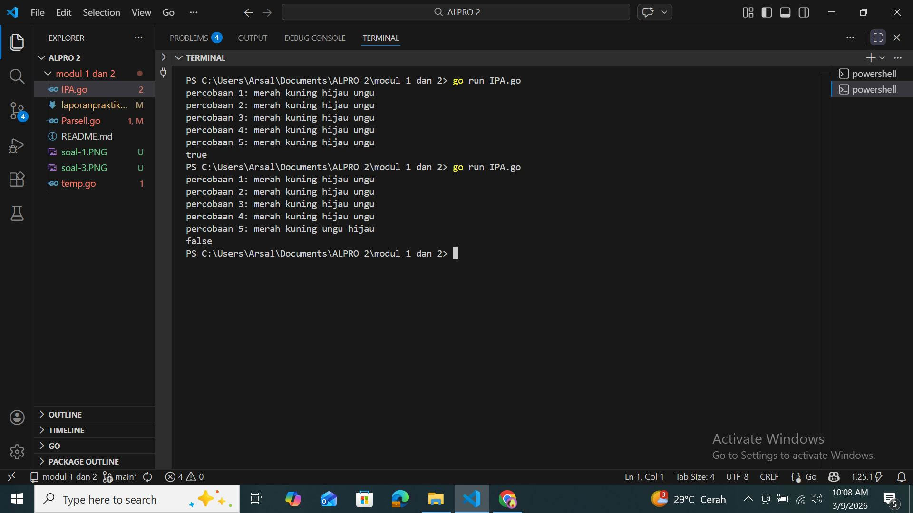
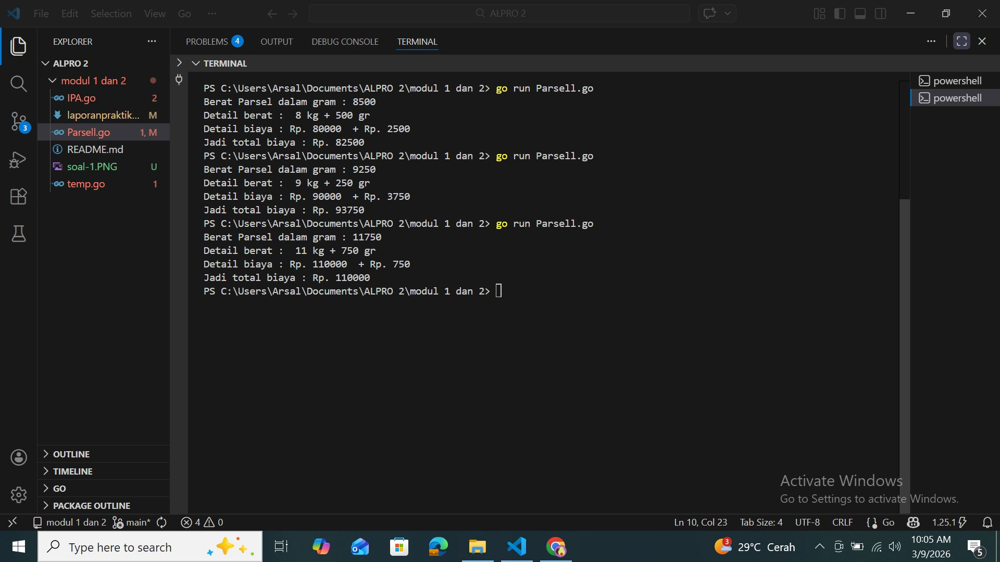

# <h1>Laporan Praktikum Modul 1 - 2</h1>

[Arsal Aji Ngroho] - [109082530039]

### 1. [Menukar Nilai]
#### Telusuri program berikut dengan cara mengkompilasi dan mengeksekusi program. Silakan masukan data yang sesuai sebanyak yang diminta program. Perhatikan keluaran yang diperoleh. Coba terangkan apa sebenarnya yang dilakukan program tersebut?

    package main

	import "fmt"

	func main() {

	var (
	satu, dua, tiga string
		temp string
	)

	fmt.Print("Masukan input string: ")
	fmt.Scanln(&satu)
	fmt.Print("Masukan input string: ")
	fmt.Scanln(&dua)
	fmt.Print("Masukan input string: ")
	fmt.Scanln(&tiga)
		fmt.Println("Output awal = " + satu + " " + dua + " " + tiga)
			temp = satu
			satu = dua
			dua = tiga
			tiga = temp
    fmt.Println("Output akhir = " + satu + " " + dua + " " + tiga)
    }

 
##### Output

 [Program meminta untuk memasukkan tiga string dengan Output awal satu, dua dan tiga kemudian masuk pada operasinya dimana ada temp untuk menyimpan variabel sementara(variabel satu), ini berfungsi agar saat print output variabel satu tidak hilang. setelah masuk ke operasinya, angka satu akan langsung berubah menjadi dua, kemudia angka dua menjadi tiga, lalu tiga menjadi satu. Dan hasil Output Akhirnya adalah dua, tiga, satu]

### 2. [Praktikum Kimia]
#### Buatlah sebuah program yang menerima input berupa warna dari ke 4 gelas reaksi sebanyak 5 kali percobaan. Kemudian program akan menampilkan true apabila urutan warna sesuai dengan informasi yang diberikan pada paragraf sebelumnya, dan false untuk urutan warna lainnya.

    package main

    import "fmt"

    func main() {
	var a, b, c, d string
	
	hasil := true

	for i := 1; i <= 5; i++ {
		fmt.Print("percobaan ", i, ": ")
		fmt.Scan(&a, &b, &c, &d)
		if a != "merah" || b != "kuning" || c != "hijau" || d != "ungu" {
			hasil = false
		    }	    
        }
	fmt.Println(hasil)
    }

 
##### Output

 [program meminta kita memasukkan string berupa beberapa warna yaitu merah,kuning,hijau,ungu] kemudian masuk pada iterasi yang dimulai dari 1 hingga 5 kali perulangan. kemudian ada hasil yang nilai awalnay adalah true dan hasil pada IF bernilai false, ini berguna jika ada salah satu warna yang diinputkan tidak sama maka hasil/outputnya akan false. dan jika warna warna yang diinputkan benar maka hasilnya true

### 3. [Berat Parsel]
#### Dari berat parsel (dalam gram), harus dihitung total berat dalam kg dan sisanya (dalam gram). Biaya jasa pengiriman adalah Rp. 10.000,- per kg. Jika sisa berat tidak kurang dari 500 gram, maka tambahan biaya kirim hanya Rp. 5,- per gram saja. Tetapi jika kurang dari 500 gram, maka tambahan biaya akan dibebankan sebesar Rp. 15,- per gram. Sisa berat (yang kurang dari 1kg) digratiskan biayanya apabila total berat ternyata lebih dari 10kg.

    package main

    import "fmt"

    func main () {
	    var parsel, total_berat, sisa_berat, biaya_kirim int
	

	fmt.Print("Berat Parsel dalam gram : ")
	fmt.Scan(&parsel) 
	
	total_berat = parsel / 1000
	sisa_berat = parsel % 1000
	fmt.Println("Detail berat : ", total_berat  ,"kg +",sisa_berat ,"gr" )
	
	

	if sisa_berat == 500 {
		fmt.Println("Detail biaya : Rp.", (total_berat * 10000), " + Rp.", (sisa_berat * 5))
		biaya_kirim =  (total_berat * 10000) + (sisa_berat * 5)
	}else if sisa_berat < 500 {
		fmt.Println("Detail biaya : Rp.", (total_berat * 10000), " + Rp.", (sisa_berat * 15))
		biaya_kirim = (total_berat * 10000) + (sisa_berat * 15)
	}else if sisa_berat > 500{
		fmt.Println("Detail biaya : Rp.", (total_berat * 10000), " + Rp.", (sisa_berat))
		biaya_kirim = (total_berat * 10000) + 0
	    }	
	
	
	fmt.Println("Jadi total biaya : Rp.", biaya_kirim)
    
    }

 
##### Output

 [Program diatas merupakan program yang bertujuan untuk menghitung biaya pengiriman parsel secara total. Dari code diatas diketahui :
 -Berat parsel dalam satuan gram.
 -Tiap kilogramnya dikenakan tarif 10.000 untuk jasa pengiriman.
 -Jika sisa berat (modulus) = 500 gram maka akan dikenakan biaya kirim Rp. 5 / gram.
 -Jika sisa berat (modulus) < 500 gram maka akan dikenakan biaya kirim Rp. 15 / gram.
 -Jika sisa berat (modulus) > 500 gram dan beratnya > 10 kg, maka tidak dikenakan tarif pengiriman.
Cara program berjalan :
Jika kita input berat parsel 8500 (gram), Maka akan menjalankan kondisi if yang pertama dengan if = 500 (tidak kurang atau lebih dari 500 gram) lalu selanjutnya akan dihitung untuk biaya kirim dengan rumus biaya_kirim = (total_berat * 10000) + (sisa_berat * 5). Lalu program akan menghasilkan output biaya kirim sebesar 82500.
Kondisi else If ke-2 dan 3 berlaku sama, hanya saja pada kondisi else if ke-3 tidak dikenakan biaya kirim jadi cukup : biaya_kirim = (total_berat * 10000)]

