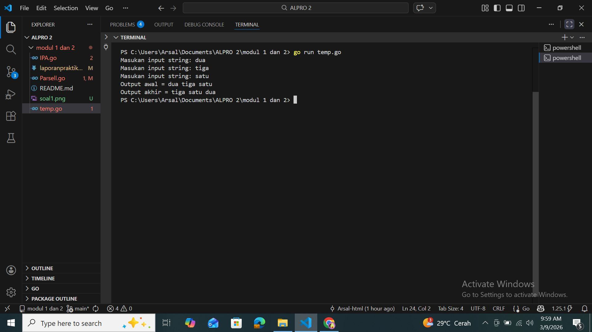

# <h1>Laporan Praktikum Modul 1 - 2</h1>

[Arsal Aji Ngroho] - [109082530039]

### 1. [SOAL 1]
#### Soal1.go

package main

import "fmt"

func main() {

var (
satu, dua, tiga string
 temp string
)

fmt.Print("Masukan input string: ")
 fmt.Scanln(&satu)
 fmt.Print("Masukan input string: ")
 fmt.Scanln(&dua)
 fmt.Print("Masukan input string: ")
 fmt.Scanln(&tiga)
 fmt.Println("Output awal = " + satu + " " + dua + " " + tiga)
 temp = satu
 satu = dua
 dua = tiga
 tiga = temp
 fmt.Println("Output akhir = " + satu + " " + dua + " " + tiga)
}

### Output Unguided : 

##### Output

 []
