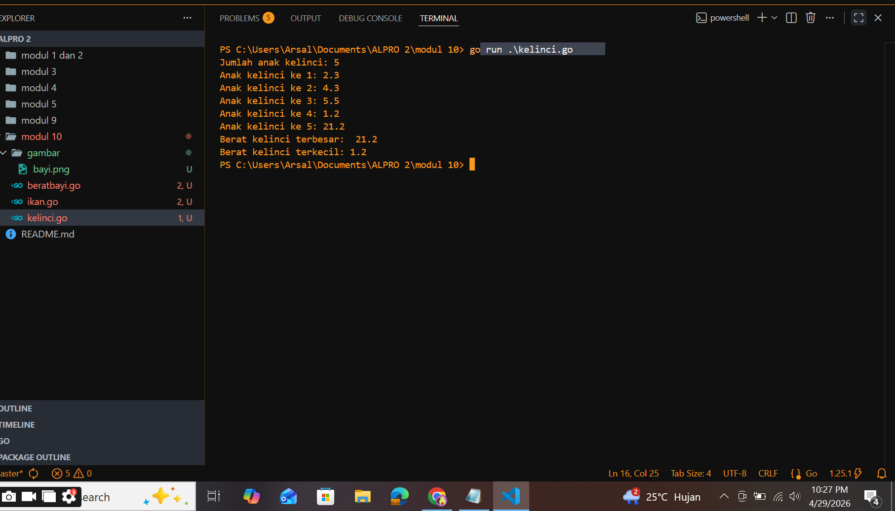
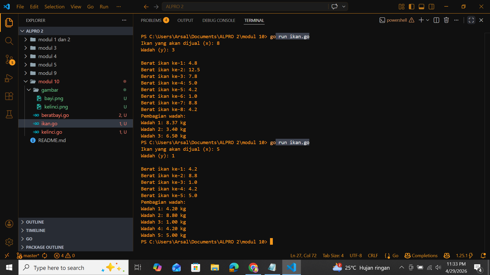
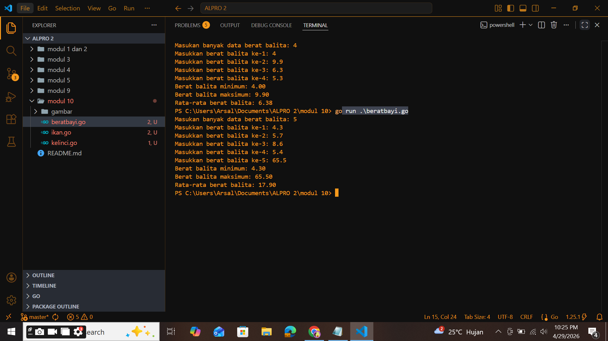

# <h1 align="center"> Laporan Praktikum Modul 5 </h1>
<p align="center">  [Arsal Aji Nugroho] - [109082530039] </p>

## Unguided 

### 1. [Berat_Kelinci]
#### Sebuah program digunakan untuk mendata berat anak kelinci yang akan dijual ke pasar. Program ini menggunakan array dengan kapasitas 1000 untuk menampung data berat anak kelinci yang akan dijual. 
#### </br>Masukan terdiri dari sekumpulan bilangan, yang mana bilangan pertama adalah bilangan bulat N yang menyatakan banyaknya anak kelinci yang akan ditimbang beratnya. Selanjutnya N bilangan riil berikutnya adalah berat dari anak kelinci yang akan dijual.
#### </br>Keluaran terdiri dari dua buah bilangan riil yang menyatakan berat kelinci terkecil dan terbesar.

```go
package main

import "fmt"

func hitung(kelinci[1000]float64, A int) {
	for i := 0; i < A; i++{
		fmt.Printf("Anak kelinci ke %d: ",i+1)
		fmt.Scan(&kelinci[i])
	}
	max := kelinci[0]
	min := kelinci[0]
	for i := 1; i < A; i++{
	if kelinci[i] > max {
		max = kelinci[i]
	}else if kelinci[i] < min {
		min = kelinci[i]
	}
}
	fmt.Println("Berat kelinci terbesar: ",max)
	fmt.Print("Berat kelinci terkecil: ",min)

}

func main() {
	var kelinci[1000] float64
	var N int
	fmt.Print("Jumlah anak kelinci: ")
	fmt.Scan(&N)

	hitung(kelinci, N)

}
```

### Output Unguided :

##### Output 


[Program mencari nilai maksimal dan minimal dari berat yang diinputkan. Array dengan kapasitas 1000 bertipe float64 yang berguna sebagai berat.perulangan pertama untuk megscan berat kelinci per indeks[i], dengan i dimulai dari 0 yang akan berhenti sesuai inputan. perulangan kedua akan menghitung berat min kelinci dan max-nya. Pada bagian else if digunakan untuk membandingkan setiap berat kelinci dengan nilai max(besar) sementara dan min(kecil) sementara. lalu menimpa nilai tersebut jika ditemukan nilai yang lebbih besar atau lebih kecil.]

### 2. [Berat_Ikan_Tiap_Wadah]
#### Sebuah program digunakan untuk menentukan tarif ikan yang akan dijual ke pasar. Program ini menggunakan array dengan kapasitas 1000 untuk menampung data berat ikan yang akan dijual. 
#### </br> terdiri dari dua baris, yang mana baris pertama terdiri dari dua bilangan bulat x dan y. Bilangan x menyatakan banyaknya ikan yang akan dijual, sedangkan y adalah banyaknya ikan yang akan dimasukan ke dalam wadah. Baris kedua terdiri dari sejumlah x bilangan riil yang menyatakan banyaknya ikan yang akan dijual.
#### </br> Keluaran terdiri dari dua baris. Baris pertama adalah kumpulan bilangan riil yang menyatakan total berat ikan di setiap wadah (jumlah wadah tergantung pada nilai x dan y, urutan ikan yang dimasukan ke dalam wadah sesuai urutan pada masukan baris ke-2). Baris kedua adalah sebuah bilangan riil yang menyatakan berat rata-rata ikan di setiap wadah.


```go
	package main

import "fmt"

func beratIkan(ikan [1000]float64) {
	var x, y int
	fmt.Print("Ikan yang akan dijual (x): ")
	fmt.Scan(&x)
	fmt.Print("Wadah (y): ")
	fmt.Scan(&y)

		fmt.Println()

	for i := 0; i < x; i++ {
		fmt.Printf("Berat ikan ke-%d: ", i+1)
		fmt.Scan(&ikan[i])
	}
	fmt.Println("Pembagian wadah: ")
	for i := 0; i < x; i += y {
		var total float64 = 0
		var jumlah int = 0

		for j := i; j < i+y && j < x; j++ {
			total += ikan[j]
			jumlah++
		}
		fmt.Printf("Wadah %d: %.2f kg\n", (i/y)+1, total/float64(jumlah))
	}
}
func main() {
	var ikan [1000]float64
	beratIkan(ikan)
}


```
### Output Unguided :

##### Output 


[Pada func main, jumlah array ikan dengan kapasitas indeks 1000 bertipe float64, kemudian memanggil fungsi beratIkan() dengan mengirimkan array ikan sebagai parameter. kemudian masuk ke func beratIkan dengan perulangan berjalan sebanyak x (jumlah ikan) berat ikan akan masuk pada tiap tiap indeks. lalu masuk ke pembagian wadahnya, i dimulai dari 0 dengan i bertambah sebesar y(wadah yang dinputkan) masuk ke loop j dimulai dari nilai i (indeks awal wadah) Perulangan berhenti jika j mencapai i+y (batas wadah) ATAU j mencapai x (jumlah ikan habis). pada setiap iterasi akan menambahkan berat ikan ke variabel total. lalu jumlah++ ini bertujuan untuk tiap wadah kedapatan berapa ikan. Rata rata tiap wadah dihiutng dengan i yang dibagi y(wadah)+1, total/jumlah.]


### 3. [Balita]
#### Pos Pelayanan Terpadu (posyandu) sebagai tempat pelayanan kesehatan perlu mencatat data berat balita (dalam kg). Petugas akan memasukkan data tersebut ke dalam array. Dari data yang diperoleh akan dicari berat balita terkecil, terbesar, dan reratanya. 

```go
 package main

import "fmt"

type arrBalita [100]float64
func hitungMinMax(arrBerat *arrBalita, bMin, bMax *float64, balita *int) {
	
	fmt.Print("Masukan banyak data berat balita: ")
	fmt.Scan(balita)
	for i := 0; i < *balita; i++ {
		fmt.Printf("Masukkan berat balita ke-%d: ",i+1)
		fmt.Scan(&arrBerat[i])
	}
	*bMin = arrBerat[0]
	*bMax = arrBerat[0]
	for i := 1; i < *balita; i++ {
		if arrBerat[i] < *bMin {	
			*bMin = arrBerat[i]
		}else if arrBerat[i] > *bMax {
			*bMax = arrBerat[i]
		}
		
	}
		fmt.Printf("Berat balita minimum: %.2f", *bMin)
		fmt.Println()
		fmt.Printf("Berat balita maksimum: %.2f", *bMax)
		fmt.Println()
}
	
func rerata(arrBerat *arrBalita, balita int) float64 {
	var total float64

	if balita == 0 {
		return 0
	}
	for i := 0; i < balita; i++ {
		total = total + arrBerat[i]
	}
	return total / float64(balita)
	
}
func main() {
	var arrBerat arrBalita
	var bMin, bMax float64
	var balita int
	hitungMinMax(&arrBerat, &bMin, &bMax, &balita)
	fmt.Printf("Rata-rata berat balita: %.2f", rerata(&arrBerat, balita))
}


```
### Output Unguided :

##### Output 


[Sama seperti soal kelinci hanya saja disiini ditambahkan rata rata berat dari semua nilai yang diinputkan. Pada func rerata terdapat pointer untuk menyimpan nilai berat tiap balita yang diinputkan kemudian mengembalikan nilai total / float64(balita).]


