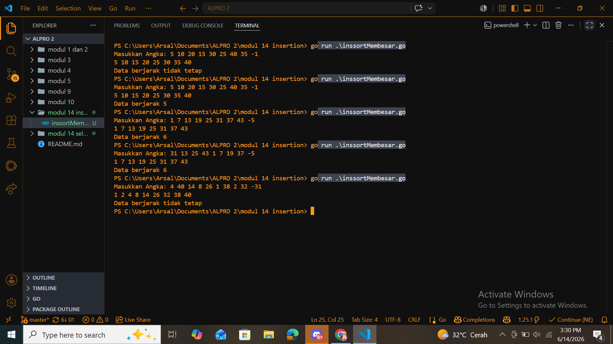
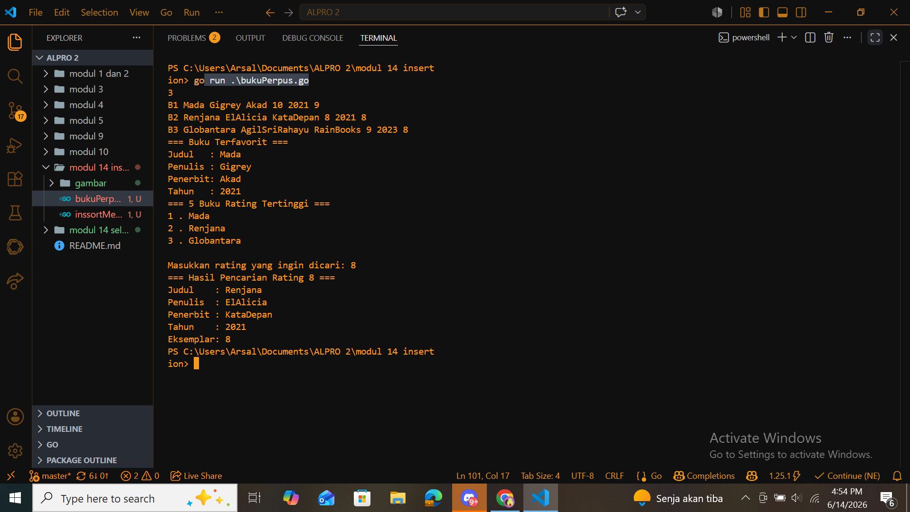

# <h1 align="center"> Laporan Praktikum Modul 14 insertion sort </h1>
<p align="center">  [Arsal Aji Nugroho] - [109082530039] </p>

## Unguided 

### 1. [Descending]
#### Buatlah sebuah program yang digunakan untuk membaca data integer seperti contoh yang diberikan di bawah ini, kemudian diurutkan (menggunakan metoda insertion sort), dan memeriksa apakah data yang terurut berjarak sama terhadap data sebelumnya. 
#### </br>Masukan terdiri dari sekumpulan bilangan bulat yang diakhiri oleh bilangan negatif. Hanya bilangan non negatif saja yang disimpan ke dalam array.
#### </br>Keluaran terdiri dari dua baris. Baris pertama adalah isi dari array setelah dilakukan pengurutan, sedangkan baris kedua adalah status jarak setiap bilangan yang ada di dalam array. "Data berjarak x" atau "data berjarak tidak tetap".

```go
package main

import "fmt"

func angkaMembesar(T [1000]int, n int) {
	i := 1
	for i <= n-1 {
		j := i
		temp := T[j]
		for j > 0 && temp < T[j-1] {
			T[j] = T[j-1]
			j = j - 1
		}
		T[j] = temp
		i = i + 1
	}
	for i := 0; i < n; i++ {
		fmt.Print(T[i], " ")
	}
	fmt.Println()

	 if n <= 1 {
		fmt.Print()
	 }else {
	jarak := T[1] - T[0]
	konsisten := true
	for i := 1; i < n-1; i++ {
    if T[i+1] - T[i] != jarak {
        konsisten = false
        break
    	}
	}
	if konsisten {
		fmt.Print("Data berjarak ", jarak)
	}else {
		fmt.Print("Data berjarak tidak tetap")
		}
	}
}

func main() {
	var T [1000]int
	var x int
	n := 0
 
	fmt.Print("Masukkan Angka: ")
	for {
		fmt.Scan(&x)
		if x < 0 {
			break 
		}
		T[n] = x
		n++
	}

	angkaMembesar(T, n)
}
```

### Output Unguided :

##### Output 


[Program meminta input angka acak dan akan mulai mencetak ketika input < 0. Kemudian program mengurutkan output menggunakan metode sorting insertion sort(Ascending yaitu terurut membesar). temp berfungsi sebagai penyimpan sementara elemen yang sedang diproses, supaya nilainya tidak hilang ketika elemen-elemen lain digeser. Kemudian akan di cetak outputnya terurut membesar dan juga akan dihitung jarak per-angkanya misal 1 7 13 19 25 31 37 43 urutan angka ini memili jarak 6.]

### 2. [Buku di Perpustakaan]
#### Sebuah program perpustakaan digunakan untuk mengelola data buku di dalam suatu perpustakaan. 
#### </br>Masukan terdiri dari beberapa baris. Baris pertama adalah bilangan bulat N yang menyatakan banyaknya data buku yang ada di dalam perpustakaan. N baris berikutnya, masing-masingnya adalah data buku sesuai dengan atribut atau field pada struct. Baris terakhir adalah bilangan bulat yang menyatakan rating buku yang akan dicari.
#### </br>Keluaran terdiri dari beberapa baris. Baris pertama adalah data buku terfavorit, baris kedua adalah lima judul buku dengan rating tertinggi, selanjutnya baris terakhir adalah data buku yang dicari sesuai rating yang diberikan pada masukan baris terakhir.


```go
	package main

import "fmt"

const nMax int = 7919

type Buku struct {
	id, judul, penulis, penerbit string
	eksemplar, tahun, rating     int
}

type DaftarBuku struct {
	Pustaka  [nMax]Buku
	nPustaka int
}

func DaftarkanBuku(pustaka *DaftarBuku, n int) {
	for i := 0; i < n; i++ {
		fmt.Scan(&pustaka.Pustaka[i].id)
		fmt.Scan(&pustaka.Pustaka[i].judul)
		fmt.Scan(&pustaka.Pustaka[i].penulis)
		fmt.Scan(&pustaka.Pustaka[i].penerbit)
		fmt.Scan(&pustaka.Pustaka[i].eksemplar)
		fmt.Scan(&pustaka.Pustaka[i].tahun)
		fmt.Scan(&pustaka.Pustaka[i].rating)
	}
}

func CetakTerfavorit(pustaka DaftarBuku, n int) {
	max := 0
	for i := 0; i < n; i++ {
		if pustaka.Pustaka[i].rating > pustaka.Pustaka[max].rating {
			max = i
		}
	}
	fmt.Println("=== Buku Terfavorit ===")
	fmt.Println("Judul   :", pustaka.Pustaka[max].judul)
	fmt.Println("Penulis :", pustaka.Pustaka[max].penulis)
	fmt.Println("Penerbit:", pustaka.Pustaka[max].penerbit)
	fmt.Println("Tahun   :", pustaka.Pustaka[max].tahun)
}

func UrutBuku(pustaka *DaftarBuku, n int) {
	for i := 1; i < n; i++ {
		j := i
		temp := pustaka.Pustaka[j]
		for j > 0 && pustaka.Pustaka[j-1].rating < temp.rating {
			pustaka.Pustaka[j] = pustaka.Pustaka[j-1]
			j--
		}
		pustaka.Pustaka[j] = temp
	}
}

func Cetak5Terbaru(pustaka DaftarBuku, n int) {
	fmt.Println("=== Buku Rating Tertinggi ===")
	for i := 0; i < 5 && i < n; i++ {
		fmt.Println(i+1,".", pustaka.Pustaka[i].judul)
	}
}

func CariBuku(pustaka DaftarBuku, n int, r int) {
	kiri := 0
	kanan := n - 1
	ketemu := -1
	for kiri <= kanan {
		mid := (kiri + kanan) / 2
		if pustaka.Pustaka[mid].rating == r {
			ketemu = mid
			break
		} else if pustaka.Pustaka[mid].rating < r {
			kanan = mid - 1
		} else {
			kiri = mid + 1
		}
	}
	fmt.Println("=== Hasil Pencarian Rating", r, "===")
	if ketemu == -1 {
		fmt.Println("Tidak ada buku dengan rating seperti itu")
	} else {
		fmt.Println("Judul    :", pustaka.Pustaka[ketemu].judul)
		fmt.Println("Penulis  :", pustaka.Pustaka[ketemu].penulis)
		fmt.Println("Penerbit :", pustaka.Pustaka[ketemu].penerbit)
		fmt.Println("Tahun    :", pustaka.Pustaka[ketemu].tahun)
		fmt.Println("Eksemplar:", pustaka.Pustaka[ketemu].eksemplar)
	}
}

func main() {
	var daftar DaftarBuku
	var N int
	var r int

	fmt.Scan(&N)
	DaftarkanBuku(&daftar, N)
	CetakTerfavorit(daftar, N)
	UrutBuku(&daftar, N)
	Cetak5Terbaru(daftar, N)
	fmt.Println()
	fmt.Print("Masukkan rating yang ingin dicari: ")
	fmt.Scan(&r)
	fmt.Println()
	CariBuku(daftar, N, r)
}


```
### Output Unguided :

##### Output 


[Program meminta untuk memasukkan input berapa buku lalu kemudian mengisi data dari buku bukunya, misal id, judul, penulis, penerbit, eksemplar, tahun, rating. contoh: B1 Mada Gigrey Akad 10 2021 9. Lalu masukkan rating bukunya juga kemudian pada output akan mencetak beberapa baris. Baris pertama adalah data buku terfavorit, baris kedua adalah lima judul buku dengan rating tertinggi, selanjutnya baris terakhir adalah data buku yang dicari sesuai rating yang diberikan pada masukan baris terakhir. Berikut penjelasan masing masing function. 
</br>DaftarkanBuku - ini menggunakan pointer ke func main yaitu pada variabel pustaka, karena perlu mengubah isi array, disinilah identitas buku diinputkan.
</br>CetakTerfavorit - cari index buku dengan rating tertinggi pakai loop, lalu cetak judul, penulis, penerbit, tahunnya.
</br>UrutBuku - Mengurutkan array dari rating tertinggi(descending) menggunakan insertion sort. Disini menggunakan pointer karena perlu mengubah isi array juga.
</br>Cetak5Terbaru - ini untuk mencetak 5 buku teratas berdasarkan rating tertinggi(sudah di urutkan pada func UrutBuku) Jadi tinggal ambil index 0 sampai 4. Data buku boleh kurang dari 5.
</br>CariBuku -  cari buku berdasarkan rating menggunakan binary search. Array sudah descending jadi arah pencariannya dibalik dari binary search biasa. Kalau tidak ketemu cetak "Tidak ada buku dengan rating seperti itu".
</br>main - ini penggeraknya.]
