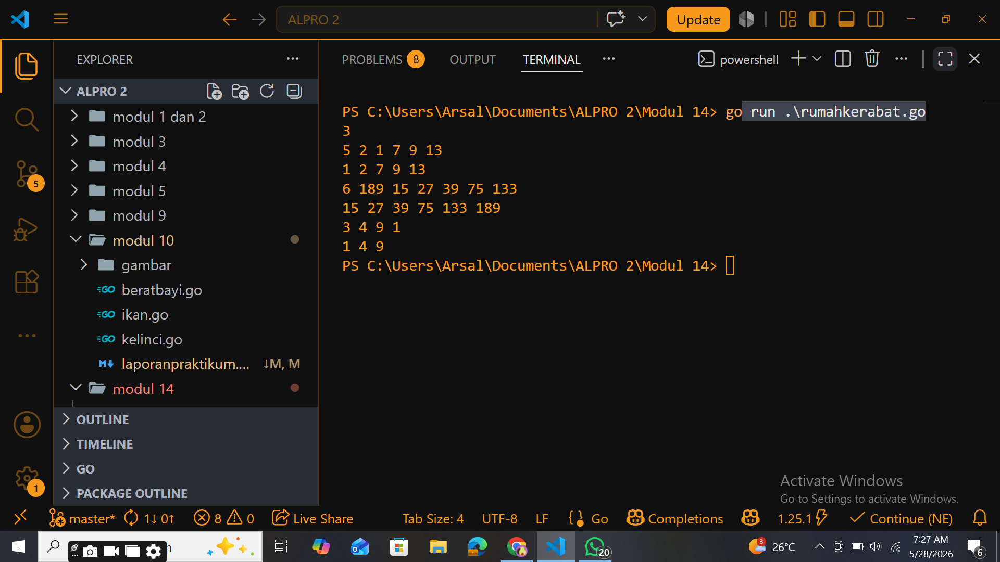
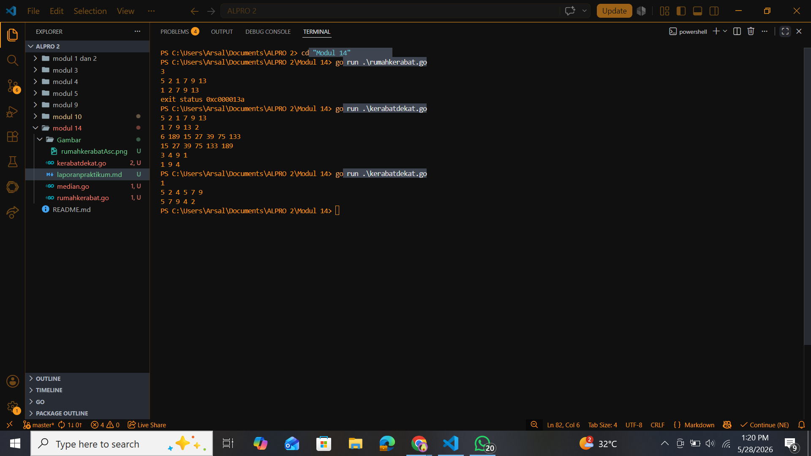
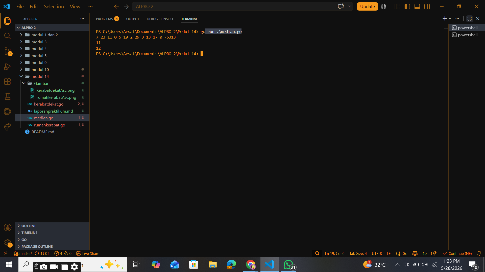

# <h1 align="center"> Laporan Praktikum Modul 14 </h1>
<p align="center">  [Arsal Aji Nugroho] - [109082530039] </p>

## Unguided 

### 1. [Rumah_kerabat]
#### buatlah program rumahkerabat yang akan menyusun nomor-nomor rumah kerabatnya secara terurut membesar menggunakan algoritma selection sort. 
#### </br>Masukan dimulai dengan sebuah integer n (0 < n < 1000), banyaknya daerah kerabat Hercules tinggal. Isi n baris berikutnya selalu dimulai dengan sebuah integer m (0 < m < 1000000) yang menyatakan banyaknya rumah kerabat di daerah tersebut, diikuti dengan rangkaian bilangan bulat positif, nomor rumah para kerabat.
#### </br>Keluaran terdiri dari n baris, yaitu rangkaian rumah kerabatnya terurut membesar di masing-masing daerah.

```go
package main

import "fmt"

type arrInt [1000000]int

func selectionAsc(T *arrInt, n int) {
	var idxMin int

	i := 1
	for i <= n - 1 {
		idxMin = i - 1
		j := i
		for j < n {
			if T[idxMin] > T[j] {
				idxMin = j
			}
			j++	
		}
		t := T[idxMin]
		T[idxMin] = T[i - 1]
		T[i - 1] = t
		i++
	}
}

func main() {
	var n, m int
	var a arrInt

	fmt.Scan(&n)

	i := 0
	for i < n {
		fmt.Scan(&m)

		j := 0
		for j < m {
			fmt.Scan(&a[j])
			j++
		}

		selectionAsc(&a, m)

			j = 0
				for j < m {
				fmt.Print(a[j], " ")
				j++
		}
		fmt.Println()

		i++
	}

}
```

### Output Unguided :

##### Output 


[Program menginputkan n, lalu melakukan perulangan sebanyak n kali. Di setiap iterasi, dibaca integer m (jumlah rumah kerabat), diikuti input m angka yang disimpan ke array a. Lalu, fungsi selectionSortAsc dipanggil. Variabel i dimulai dari 1, perulangan menggunakan i<=n-1, kemudian nilai awal minimum(idxMin)=i-1, masuk ke perulangan j dimulai dari i, di dalam perulangan j nilai dibandingan untuk mendapatkan nilai terkecil ke terbesar nilai terus beftambah sampai n habis dikurangi 1 dalam perulangan i.]

### 2. [Kerabat_dekat]
#### buatlah program kerabat dekat yang akan menampilkan nomor rumah mulai dari nomor yang ganjil lebih dulu terurut membesar dan kemudian menampilkan nomor rumah dengan nomor genap terurut mengecil. 
#### </br> Format Masukan masih persis sama seperti sebelumnya.
#### </br> Keluaran terdiri dari n baris, yaitu rangkaian rumah kerabatnya terurut membesar untuk nomor ganjil, diikuti dengan terurut mengecil untuk nomor genap, di masing-masing daerah.


```go
	package main

import "fmt"

type isiArr [100000]int

func selectionSort(T *isiArr, n int) {
	var idx_min int

	i := 1
	for i <= n-1 {

		idx_min = i - 1

		j := i
		for j < n {

			if T[idx_min] > T[j] {
				idx_min = j
			}

			j = j + 1
		}

		t := T[idx_min]
		T[idx_min] = T[i-1]
		T[i-1] = t

		i = i + 1
	}
}

func main() {

	var n, m int
	var a isiArr

	fmt.Scan(&n)

	i := 0

	for i < n {

		fmt.Scan(&m)

		j := 0
		for j < m {

			fmt.Scan(&a[j])
			j++
		}

		selectionSort(&a, m)

		j = 0
		for j < m {

			if a[j]%2 != 0 {
				fmt.Print(a[j], " ")
			}

			j++
		}

		j = m - 1

		for j >= 0 {

			if a[j]%2 == 0 {
				fmt.Print(a[j], " ")
			}

			j--
		}

		fmt.Println()

		i++
	}
}

```
### Output Unguided :

##### Output 


[Input sama seperti Soal 1. Yang berbeda adalah cara mencetak hasilnya. Pada func Ascending samapersis juga dengan soal 1. Yang membuat beda adalah soal 2 memiliki keluaran membesar ganjil dan mengecil genap.
</br>Ganjil Ascending: Loop dimulai dari menentukan nilai (j = 0) selanjutnya (j < m). jika a[j] % 2 != 0 (ganjil), langsung dicetak. Karena array sudah ascending, bilangan ganjil yang keluar otomatis terurut membesar.
</br>Genap Descending: Loop dimulai dari menentukan (j = m-1) selanjutnya (j >= 0). jika a[j] % 2 == 0 (genap), langsung dicetak. Karena array sudah ascending dan kita baca dari kanan, bilangan genap yang keluar otomatis terurut mengecil.]


### 3. [Median]
#### Buatlah program median yang mencetak nilai median terhadap seluruh data yang sudah terbaca, jika data yang dibaca saat itu adalah 0. 
#### </br> Masukan berbentuk rangkaian bilangan bulat. Masukan tidak akan berisi lebih dari 1000000 data, tidak termasuk bilangan 0. Data 0 merupakan tanda bahwa median harus dicetak, tidak termasuk data yang dicari mediannya. Data masukan diakhiri dengan bilangan bulat -5313.
#### </br> Keluaran adalah median yang diminta, satu data per baris.
```go
 package main

import "fmt"

type arr [1000000]int

func insertionSort(T *arr, n int) {
	i := 1
	for i <= n-1 {
		j := i
		temp := T[j]
		for j > 0 && temp < T[j-1] {
			T[j] = T[j-1]
			j = j - 1
		}
		T[j] = temp
		i = i + 1
	}
}

func hitungMedian(T *arr, n int) int {
	var median int
	if n%2 != 0 {
		median = T[n/2]
	} else {
		median = (T[(n/2)-1] + T[n/2]) / 2
	}
	return median
}

func main() {
	var data arr 
	var angka, n int

	fmt.Scan(&angka)

	for angka != -5313 {
		if angka == 0 {
	
			insertionSort(&data, n)
			
			fmt.Println(hitungMedian(&data, n))
		} else {
			
			data[n] = angka
			n = n + 1
		}
		
		fmt.Scan(&angka)
	}
}


```
### Output Unguided :

##### Output 


[Program meminta input angka kemudian :
</br>Jika angka yang diinputkan terdapat 0 maka program langsung menjalankan insertion dan func hitung median. 
</br>Hitung median n ganjil if n%2 != 0 = [n/2] jika kondisi ini false maka akan ke else yaitu menghitung genap.
n genap = (data[n/2-1] + data[n/2]) / 2, pembulatan kebawah.
</br>Jika diinputkan -5313 maka program berhenti dan mencetak hasil median 0 pertema dan 0 kedua contoh input (7 23 11 0 5 19 2 29 3 13 17 0 -5313)
</br>contoh ambil data 7, 23, 11. pada perulangan nilai temp = 23. Temp berfungsi menyimpan nilai sementara sebelum nanti dibandingkan dan bergeser(insertion sort), kemudian 23 dibandingkan dengan 7. Karena 23 tidak lebih kecil dari 7, perulangan dalam tidak berjalan dan 23 tetap di posisinya. kemudian temp = 11 dibandingkan dengan 23. Karena 11 lebih kecil dari 23, elemen 23 digeser ke kanan sehingga array menjadi 7, 23, 23. Kemudian 11 dibandingkan dengan 7, karena 11 tidak lebih kecil dari 7 maka perulangan dalam berhenti dan 11 ke posisi depan, menghasilkan array [7, 11, 23].]


