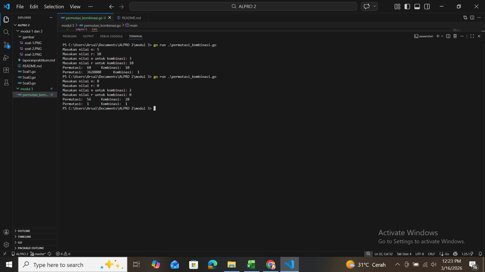
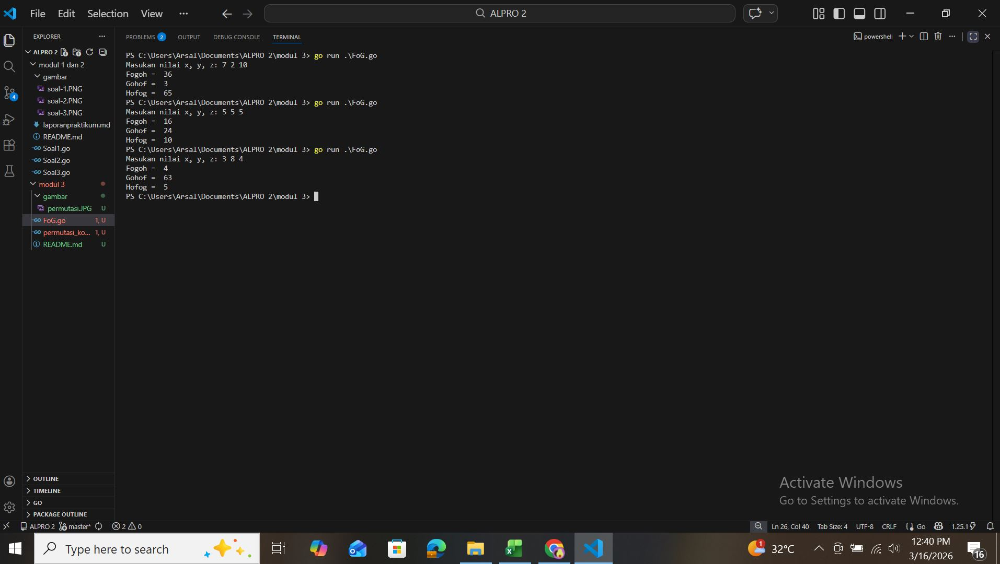
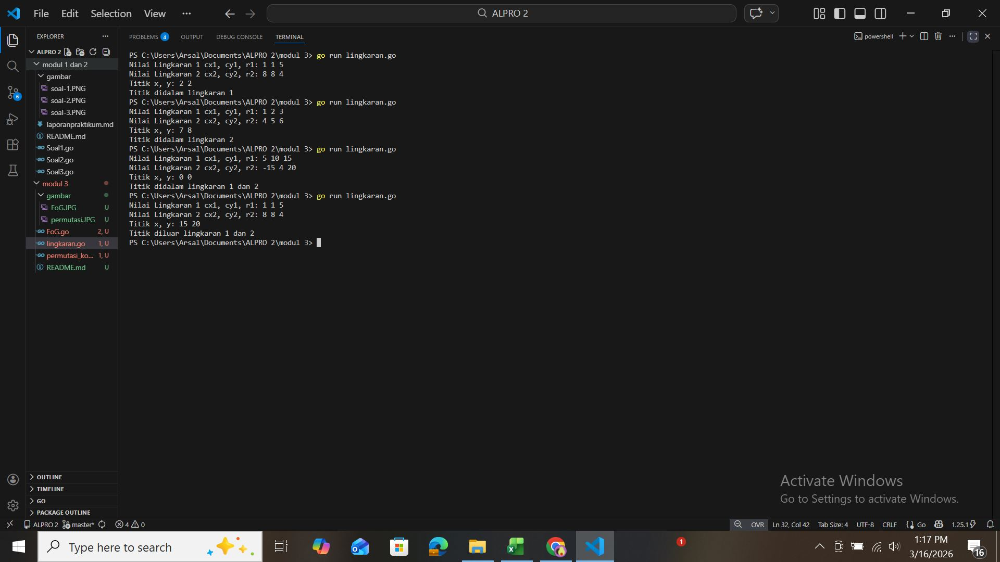

# <h1 align="center"> Laporan Praktikum Modul 3 </h1>
<p align="center">  [Arsal Aji Nugroho] - [109082530039] </p>

## Unguided 

### 1. [PERMUTASI_DAN_KOMBINASI]
#### Minggu ini, mahasiswa Fakultas Informatika mendapatkan tugas dari mata kuliah matematika diskrit untuk mempelajari kombinasi dan permutasi. Jonas salah seorang mahasiswa, iseng untuk mengimplementasikannya ke dalam suatu program. 
#### Masukan terdiri dari empat buah bilangan asli a, b, c, dan d yang dipisahkan oleh spasi, dengan syarat a ≥ c dan b ≥ d. 
#### Keluaran terdiri dari dua baris. Baris pertama adalah hasil permutasi dan kombinasi a terhadap c, sedangkan baris kedua adalah hasil permutasi dan kombinasi b terhadap d.
#### Catatan: permutasi (P) dan kombinasi (C) dari n terhadap r (n ≥ r) dapat dihitung dengan menggunakan persamaan berikut!
#### P(n, r) = n! / (n−r)!, sedangkan C(n, r) = n! / r!(n−r)!

```go
    package main

import "fmt"

func faktorial(n int) int {
	hasil := 1
	for i := 1; i <= n; i++ {
		hasil *= i
	}
	return hasil
}

func permutasi(n, r int) int {
	return faktorial(n) / faktorial(n-r)
}

func kombinasi(n, r int) int {
	return faktorial(n) / (faktorial(r) * faktorial(n-r))
}

func main() {
	var a, b, c, d int
	fmt.Print("Masukan nilai: ")
	fmt.Scanln(&a, &b, &c, &d)

	fmt.Println("Permutasi ke-1: ", permutasi(a, c),"   ", "Kombinasi ke-1: ", kombinasi(a, c))
	fmt.Println("Permutasi ke-2: ", permutasi(b, d), "    ", "Kombinasi ke-2: ", kombinasi(b, d))
}
```
### Output Unguided :

##### Output 

[Menghitung permutasi - pertama program akan menjalankan func main yang akan membaca a, b, c dan d, lalu masuk pada cetak permutasi pertama(func permutasi). masuk pada func permutasi kemudian memanggil func faktorial (a sebagai n). Hitung pembilang misal input 5 berarti faktorialnya 120(hasil * i) kemudian nilai ini dikembalikan ke func permutasi sebagai pembilang kemudian menghitung penyebut dengan n= 5 dan r = 3 (n-r)! hasilnya adalah 2!, dikembalikan lagi pada faktorial muncullah hasil 2, kemudian dikembalikan ke permutasi dengan rumus permutasi hasilnya 120/2 = 60.
</br> Menghitung kombinasi - Program mencetak a,c kombinasi pertama, lalu ke func kombinasi untuk menghitung rumus kombinasi, dan memanggil func faktorial (a sebagai n). Hitung pembilang misal 5 berati faktorialnya 120(hasil * i) kemudian nilai ini dikembalikan ke func kombinasi sebagai pembilang kemudian menghitung penyebut n = 5 dan r = 3 (r! * (n-r)!) hasilnya adalah 3! * 2!, dikembalikan ke faktorial hasilnya 12, dikembalikan ke kombinasi dengan rumus kombinasi hasilnya 120/12 adalah 10
</br>Ini berlaku juga untuk permutasi dan kombinasi b,d]

### 2. [FoG]
#### Diberikan tiga buah fungsi matematika yaitu f (x) = x^2, g (x) = x − 2 dan h (x) = x + 1. Fungsi komposisi (fogoh)(x) artinya adalah f(g(h(x))). Tuliskan f(x), g(x) dan h(x) dalam bentuk function.
#### Masukan terdiri dari sebuah bilangan bulat a, b dan c yang dipisahkan oleh spasi.
#### Keluaran terdiri dari tiga baris. Baris pertama adalah (fogoh)(a), baris kedua (gohof)(b), dan baris ketiga adalah (hofog)(c)!

```go
    package main

	import "fmt"

		func Fx(x int) int {
			hasil := x * x
			return hasil
	}

		func Gx(x int) int {
			hasil := x - 2
			return hasil
	}

		func Hx(x int) int {
		hasil := x + 1
		return hasil
	}

		func main() {
			var a, b, c  int
			fmt.Print("Masukan nilai a, b, c: ")
			fmt.Scanln(&a,&b, &c)
			fmt.Println("Fogoh = ", (Fx(Gx(Hx(a)))))
			fmt.Println("Gohof = ", (Gx(Hx(Fx(b)))))
			fmt.Println("Hofog = ", (Hx(Fx(Gx(c)))))
	}


```
### Output Unguided :

##### Output 

[HItung fogoh - Scan a lalu lalu Print a untuk menghitung fogoh, masuk ke func Hx misal x = 5, di dalam Hx 5 + 1 = 6 kemudian hasil dikembalikan ke Gx 6 - 2 = 4, kemudian hasil dari Gx dikembalikan ke Fx 4 * 4 = 16. Jadi hasil dari fogoh dengan x = 5 adalah 16.
</br>Hitung gohof - Scan b lalu Print ab untuk menghitung gohof.Masuk ke func Fx misal x = 5, di Fx 5 * 5 = 25, kemudian dikembalikan k Hx 25 + 1 = 26,kemudian ke func Gx 26 - 2 = 24. Jadi hasil gohof dengan x = 5 adalah 24.
</b>Hitung Hofog - Scan c lalu Print c, masuk ke func Gx midal x = 5, maka 5 - 2 = 3, hasil dari Gx dikembalikan ke Fx, 3 * 3 = 9, hasil ini dikembalikan ke Hx 9 + 1 = 10, jad hasil dari hofog adalah 10.
</br>Hitungan berlaku dari belakang misal kita ingin mencari hofog, maka kita akan mencari fungsi g dulu,ke fungsi f lalu berajhir di fungsi h.]


### 3. [Lingkaran]
#### Suatu lingkaran didefinisikan dengan koordinat titik pusat (cx, cy) dengan radiusr. Apabila diberikan dua buah lingkaran, maka tentukan posisi sebuah titik sembarang (x, y) berdasarkan dua lingkaran tersebut.
#### Masukan terdiri dari beberapa tiga baris. Baris pertama dan kedua adalah koordinat titik pusat dan radius dari lingkaran 1 dan lingkaran 2, sedangkan baris ketiga adalah koordinat titik sembarang. Asumsi sumbu x dan y dari semua titik dan juga radius direpresentasikan dengan bilangan bulat.
#### Keluaran berupa string yang menyatakan posisi titik "Titik di dalam lingkaran 1 dan 2", "Titik di dalam lingkaran 1", "Titik di dalam lingkaran 2", atau "Titik di luar lingkaran 1 dan 2".
#### Fungsi untuk menghitung jarak titik (a, b) dan (c, d) dimana rumus jarak adalah: jarak = √(a − c)^2 + (b − d)^2 dan juga fungsi untuk menentukan posisi sebuah titik sembarang berada di dalam suatu lingkaran atau tidak. Gunakan fungsi math.Sqrt() untuk menghitung akar kuadrat.

```go

	package main

	import (
	"fmt"
	"math"
	)

		func jarak(a, b, c, d float64) float64 {
		hasil := math.Sqrt((a - c)*(a - c) + (b - d)*(b - d))
			return hasil
		}

		func didalam(cx, cy, r, x, y float64) bool {
		if jarak(cx, cy, x, y) < r {
			return true
		}
				return false
	}

		func main() {	
		var cx1, cy1, r1 float64
		var cx2, cy2, r2 float64
		var x, y float64

		fmt.Print("Nilai Lingkaran 1 cx1, cy1, r1: ")
		fmt.Scanln(&cx1, &cy1, &r1)
		fmt.Print("Nilai Lingkaran 2 cx2, cy2, r2: ")
		fmt.Scanln(&cx2, &cy2, &r2)
		fmt.Print("Titik x, y: ")
		fmt.Scanln(&x, &y)

		dalam1 := didalam(cx1, cy1, r1, x, y)
		dalam2 := didalam(cx2, cy2, r2, x, y)
			if dalam1 && dalam2 {
			fmt.Println("Titik didalam lingkaran 1 dan 2")
			} else if dalam1 {
			fmt.Println("Titik didalam lingkaran 1")
			} else if dalam2 {
			fmt.Println("Titik didalam lingkaran 2")
			} else {
			fmt.Println("Titik diluar lingkaran 1 dan 2")
		}
	}

```
### Output Unguided :

##### Output 

[misal kita input untuk lingkaran 1 : 1 2 3 7 8 dan lingkaran 2 : 4 5 6 7 8
</br>masuk pada hitungan lingkaran yang pertama, dengan radius 3, masuk ke perhitungan jarak menggunakan rumus math.Sqrt((1 - 7)*(1 - 7) + (2 - 8)*(2 - 8)) hasilnya adalah 8.485, hasil ini dikembalikan fungsi didalam untuk melihat nilai apakah hasil dari jarak lebih kecil dari r(radius), dan ternyata ini false.
</br>Hiutng Lingkaran ke 2 dengan radius 6, gunakan rumus pada func jarak math.Sqrt((4 - 7)*(4 - 7) + (5 - 8)*(5 - 8)) hasilnya adalah 4.242 ini bernilai true karna hasil dari jarak lebih kecil dari radius hasil ini dikembalikan ke func didalam dan menghasilkan nilai true.
<br/>Dari kedua hasil tadi masuk ke kondisi if-else-if dan mengecek nilainya satu persatu dan di temukan hasil yang benar yaitu pada lingkaran ke-2(else-if dalam2) kemudian hasil string akan dicetak "Titik didalam lingkaran 2"]


