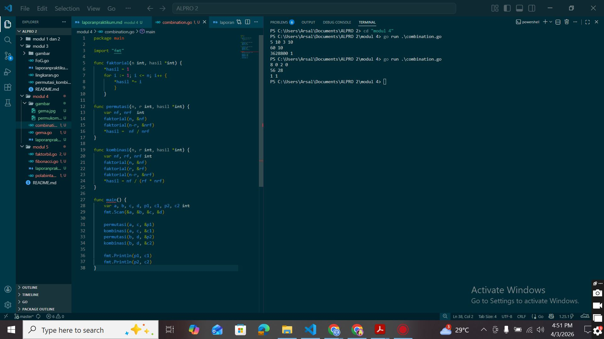
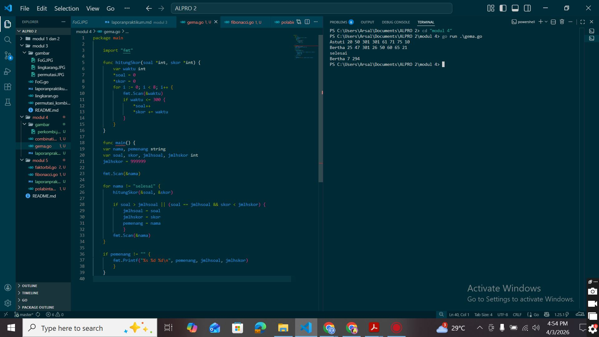

# <h1 align="center"> Laporan Praktikum Modul 3 </h1>
<p align="center">  [Arsal Aji Nugroho] - [109082530039] </p>

## Unguided 

### 1. [PERMUTASI_DAN_KOMBINASI]
#### Minggu ini, mahasiswa Fakultas Informatika mendapatkan tugas dari mata kuliah matematika diskrit untuk mempelajari kombinasi dan permutasi. Jonas salah seorang mahasiswa, iseng untuk mengimplementasikannya ke dalam suatu program. 
#### Masukan terdiri dari empat buah bilangan asli a, b, c, dan d yang dipisahkan oleh spasi, dengan syarat a ≥ c dan b ≥ d. 
#### Keluaran terdiri dari dua baris. Baris pertama adalah hasil permutasi dan kombinasi a terhadap c, sedangkan baris kedua adalah hasil permutasi dan kombinasi b terhadap d.
#### Catatan: permutasi (P) dan kombinasi (C) dari n terhadap r (n ≥ r) dapat dihitung dengan menggunakan persamaan berikut!
#### P(n, r) = n! / (n−r)!, sedangkan C(n, r) = n! / r!(n−r)!.

```go
   package main

import "fmt"

func faktorial(n int, hasil *int) {
	*hasil = 1
	for i := 1; i <= n; i++ {
		*hasil *= i
		}
	}

func permutasi(n, r int, hasil *int) {
	var nfaktorial, nrfaktorial int
	faktorial(n, &nfaktorial)
	faktorial(n-r, &nrfaktorial)
	*hasil =  nfaktorial / nrfaktorial
}

func kombinasi(n, r int, hasil *int) {
	var nfaktorial, rfaktorial, nrfaktorial int
	faktorial(n, &nfaktorial)
	faktorial(r, &rfaktorial)
	faktorial(n-r, &nrfaktorial)
	*hasil = nfaktorial / (rfaktorial * nrfaktorial)
}

func main() {
	var a, b, c, d, p1, c1, p2, c2 int
    fmt.Scan(&a, &b, &c, &d)

    permutasi(a, c, &p1)
    kombinasi(a, c, &c1)
    permutasi(b, d, &p2)
    kombinasi(b, d, &c2)

    fmt.Println(p1, c1)
    fmt.Println(p2, c2)
}

```
### Output Unguided :

##### Output 


[Program ini adalah program Go untuk menghitung permutasi dan kombinasi dari dua bilangan yang diinputkan pengguna.
</br>Fungsi faktorial digunakan untuk menghitung n! dengan perulangan, dan menggunakan pointer agar hasil langsung disimpan ke variabel tanpa return(karna pointer berguna untuk menyimpan nilai sementara jadi tidak perlu mengembalikan nilai ke func lain).
</br>Fungsi permutasi (n!/(n−r)!) dan kombinasi (n!/(r!(n−r)!)) mengambil nilai dari func faktorial karna menggunakan pointer tadi jadi langsung masuk ke func permutasi dan kombinasi.
</br>Di fungsi main, program membaca empat bilangan, menghitung hasil untuk dua pasangan(permutasi dan kombinasi), lalu menampilkannya dalam dua baris. baris pertama nebghasilkan output permutasi dan kombinasi yang pertama, dan baris kedua menghasilkan output permutasi dan kombinasi kedua.]

### 2. [GEMA]
#### Kompetisi pemrograman tingkat nasional berlangsung ketat. Setiap peserta diberikan 8 soal yang harus dapat diselesaikan dalam waktu 5 jam saja. Peserta yang berhasil menyelesaikan soal paling banyak dalam waktu paling singkat adalah pemenangnya. Buat program gema yang mencari pemenang dari daftar peserta yang diberikan. Program harus dibuat modular, yaitu dengan membuat prosedur hitungSkor yang mengembalikan total soal dan total skor yang dikerjakan oleh seorang peserta, melalui parameter formal. Pembacaan nama peserta dilakukan di program utama, sedangkan waktu pengerjaan dibaca di dalam prosedur. Prosedure hitungSkor(in/out soal, skor : integer) Setiap baris masukan dimulai dengan satu string nama peserta tersebut diikuti dengan adalah 8 integer yang menyatakan berapa lama (dalam menit) peserta tersebut menyelesaikan soal. Jika tidak berhasil atau tidak mengirimkan jawaban maka otomatis dianggap menyelesaikan dalam waktu 5 jam 1 menit (301 menit). Satu baris keluaran berisi nama pemenang, jumlah soal yang diselesaikan, dan nilai yang diperoleh. Nilai adalah total waktu yang dibutuhkan untuk menyelesaikan soal yang berhasil diselesaikan. 

```go

  package main

	import "fmt"

	func hitungSkor(soal *int, skor *int) {
		var waktu int
		*soal = 0
		*skor = 0
		for i := 0; i < 8; i++ {
			fmt.Scan(&waktu)
			if waktu <= 300 {
				*soal++
				*skor += waktu
			}
		}
	}
	
	func main() {
    var nama, pemenang string
    var soal, skor, jmlhsoal, jmlhskor int
    jmlhskor = 999999

	fmt.Scan(&nama)

	for nama != "selesai" {
		hitungSkor(&soal, &skor)
		
        if soal > jmlhsoal || (soal == jmlhsoal && skor < jmlhskor) {
            jmlhsoal = soal
            jmlhskor = skor
            pemenang = nama
    		}
		fmt.Scan(&nama)
	}
		
	if pemenang != "" {
		fmt.Printf("%s %d %d\n", pemenang, jmlhsoal, jmlhskor)
		}
	}


```
### Output Unguided :

##### Output 

[Di fungsi main, program membaca nama peserta satu per satu sampai memasukkan "selesai" agar program berhenti. Untuk setiap peserta, program memanggil fungsi hitungSkor dengan i <= 8 karna ada 8 soal yang diberikan dan waktu <= 300 ini juga karna diberikan waktu 5 jam.
Di fungsi hitungSkor, program membaca waktu dari 8 soal. Jika waktu ≤ 300, soal dihitung benar dan akan ditambahkan dengan waktu. Jumlah soal disimpan di soal dan total waktu disimpan di skor. semenatar nilai nama pertama disimpan pada  
</br>if soal > jmlhsoal || (soal == jmlhsoal && skor < jmlhskor) 
            jmlhsoal = soal
            jmlhskor = skor
            pemenang = nama 
			
</br>Program ini memakai pointer supaya nilai soal dan skor bisa langsung berubah tanpa return.
Setelah itu, program membandingkan hasil setiap peserta. Pemenang adalah yang soalnya paling banyak, dan pengerjaan yang cepat.]


