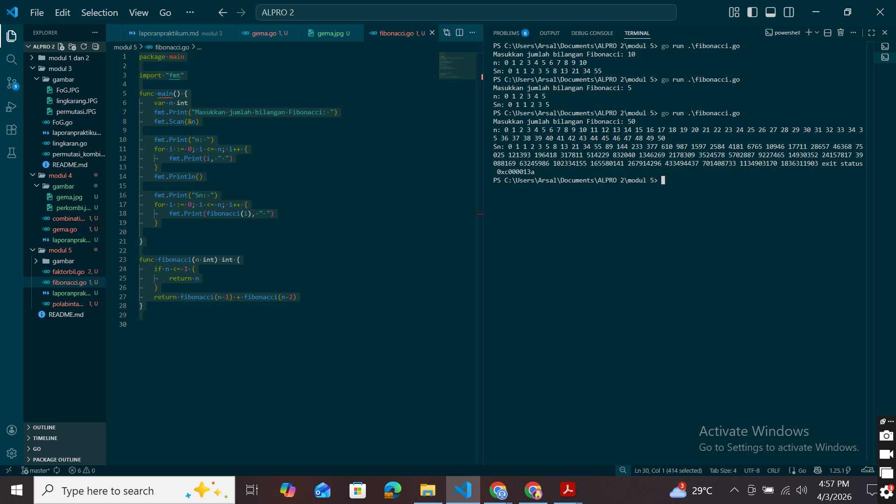
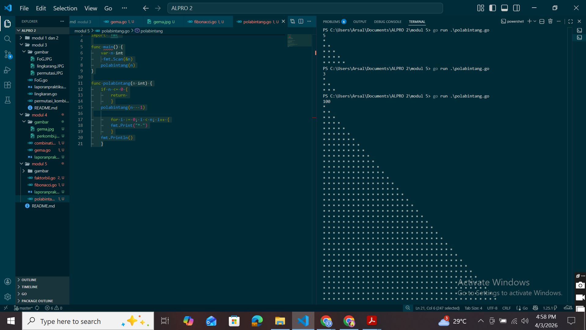
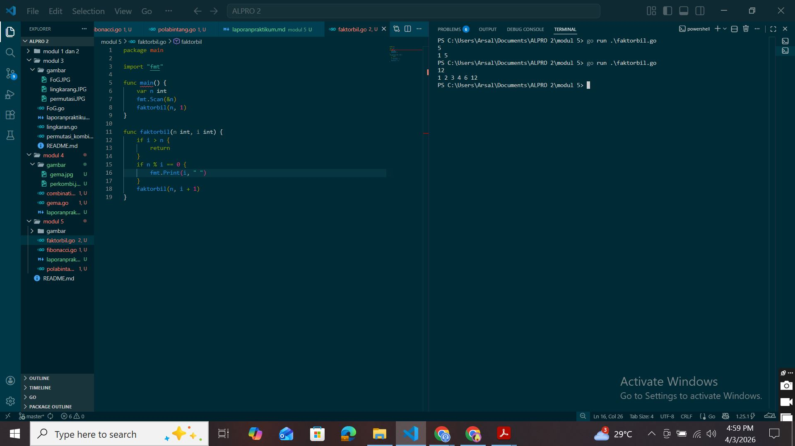

# <h1 align="center"> Laporan Praktikum Modul 3 </h1>
<p align="center">  [Arsal Aji Nugroho] - [109082530039] </p>

## Unguided 

### 1. [FIBONACCI]
#### Deret fibonacci adalah sebuah deret dengan nilai suku ke-0 dan ke-1 adalah 0 dan 1, dan nilai suku ke-n selanjutnya adalah hasil penjumlahan dua suku sebelumnya. Secara umum dapat diformulasikan Sn = Sn−1 + Sn−2 . Berikut ini adalah contoh nilai deret fibonacci hingga suku ke-10. Buatlah program yang mengimplementasikan fungsi rekursif pada deret fibonacci tersebut.

```go
   package main

import "fmt"

func main() {
	var n int
	fmt.Print("Masukkan jumlah bilangan Fibonacci: ")
	fmt.Scan(&n)

	fmt.Print("n: ")
	for i := 0; i <= n; i++ {
		fmt.Print(i, " ")
	}
	fmt.Println()

	fmt.Print("Sn: ")
	for i := 0; i <= n; i++ {
		fmt.Print(fibonacci(i), " ")
	}

}

func fibonacci(n int) int {
	if n <= 1 {
		return n
	}
	return fibonacci(n-1) + fibonacci(n-2)
}


```
### Output Unguided :

##### Output 

[Program ini adalah program Go yang menggunakan konsep rekursif yang digunakan untuk menampilkan deret Fibonacci Sn.

Pada fungsi main, program meminta pengguna memasukkan nilai n. Setelah itu, program menampilkan dua baris, yaitu baris n: yang berisi urutan angka dari 0 sampai n menggunakan kondisi looping pertama dengan keluaran i, dan baris Sn: yang berisi nilai Fibonacci dari setiap angka tersebut menggunakan looping kedua yang mengambil nilai fibonacci(i).

Perhitungan Fibonacci dilakukan pada func fibonacci yang menggunakan rekursif. Jika nilai n <= 1, maka fungsi langsung mengembalikan nilai n. Jika lebih dari 1, maka nilai Fibonacci dihitung dengan menjumlahkan dua nilai sebelumnya, yaitu fibonacci(n−1) dan fibonacci(n−2).]

### 2. [POLA BINTANG]
#### Buatlah sebuah program yang digunakan untuk menampilkan pola bintang berikut ini dengan menggunakan fungsi rekursif. N adalah masukan dari user.

```go

   package main

import "fmt"

func main() {
	var n int
	 fmt.Scan(&n)
	polabintang(n)
}

func polabintang(n int) {
	if n <= 0 {
		return 
		}
	polabintang(n - 1)

		for i := 0; i < n; i++ {
		fmt.Print("* ")
		}
	fmt.Println()
	}


```
### Output Unguided :

##### Output 

[Di fungsi main, program menyuruh user menginput n, lalu memanggil func polabintang(n).

Fungsi polabintang menggunakan rekursi. Jika n <= 0, program berhenti. Jika tidak, fungsi akan memanggil dirinya sendiri dengan n-1, baru kemudian mencetak bintang.

Setelah kembali dari rekursi, program mencetak n buah bintang dalam satu baris, lalu pindah ke baris berikutnya.

Akibatnya, pola yang muncul adalah:

Baris pertama: 1 bintang
Baris kedua: 2 bintang
dan seterusnya sampai n

Contoh jika n = 3:

</br>* 
</br>* * 
</br>* * * ]

### 3. [FAKTOR BILANGAN]
#### Buatlah program yang mengimplementasikan rekursif untuk menampilkan faktor bilangan dari suatu N, atau bilangan yang apa saja yang habis membagi N.
#### Masukan terdiri dari sebuah bilangan bulat positif N.
#### Keluaran terdiri dari barisan bilangan yang menjadi faktor dari N (terurut dari 1 hingga N ya).

```go

   package main

import "fmt"

func main() {
	var n int
	 fmt.Scan(&n)
	polabintang(n)
}

func polabintang(n int) {
	if n <= 0 {
		return 
		}
	polabintang(n - 1)

		for i := 0; i < n; i++ {
		fmt.Print("* ")
		}
	fmt.Println()
	}


```
### Output Unguided :

##### Output 

[Di fungsi main, program membaca nilai n, lalu memanggil func faktorbil mulai dari angka 1.
Fungsi faktorbil menggunakan rekursi untuk mengecek angka dari 1 sampai n. Jika suatu angka bisa membagi n (n % i == 0)(if kedua), maka angka tersebut dicetak sebagai faktor.
Proses berhenti saat i lebih dari n(if pertama).
Intinya, program ini mencari faktor bilangan dengan cara mengecek satu per satu menggunakan rekursi.]


