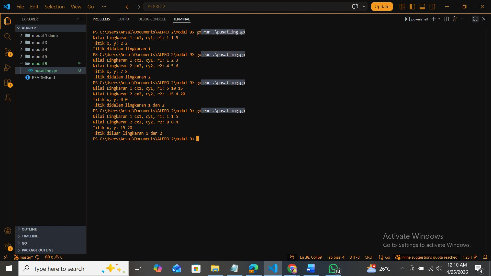
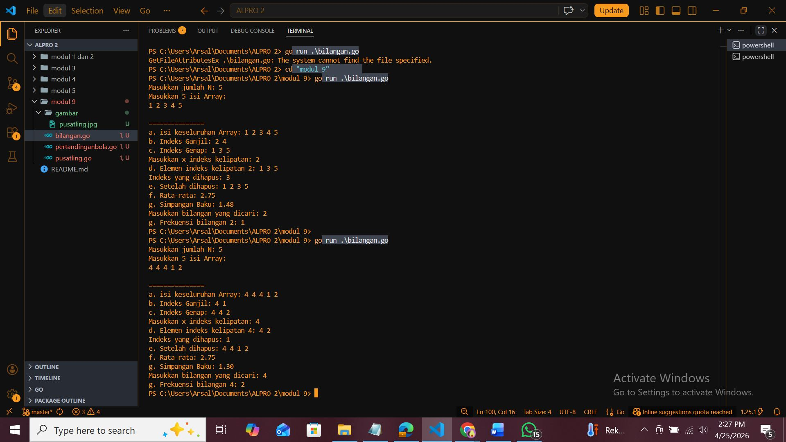
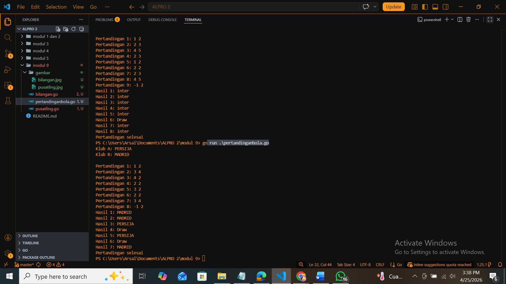
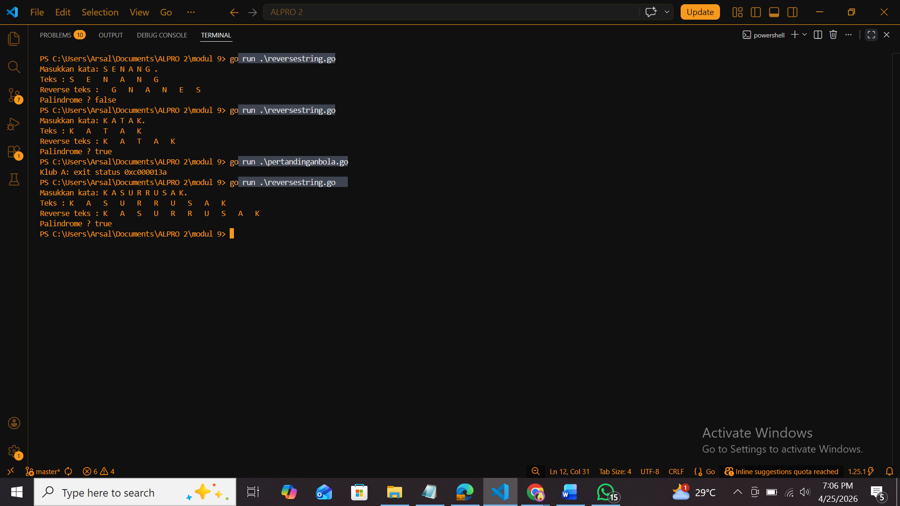

# <h1 align="center"> Laporan Praktikum Modul 5 </h1>
<p align="center">  [Arsal Aji Nugroho] - [109082530039] </p>

## Unguided 

### 1. [PUSAT_LINGKARAN]
#### Suatu lingkaran didefinisikan dengan koordinat titik pusat (𝑐𝑥,𝑐𝑦) dengan radius 𝑟. Apabila diberikan dua buah lingkaran, maka tentukan posisi sebuah titik sembarang (𝑥,𝑦) berdasarkan dua lingkaran tersebut. Gunakan tipe bentukan titik untuk menyimpan koordinat, dan tipe bentukan lingkaran untuk menyimpan titik pusat lingkaran dan radiusnya. 

```go
  package main

	import (
	"fmt"
	"math"
	)
	type  T struct{
	x, y float64
	}
	type ling struct {
	cx, cy, r float64
	
	}

	func jarak(a, b, c, d float64) float64 {
	hasil := math.Sqrt((a - c)*(a - c) + (b - d)*(b - d))
	return hasil
	}

	func didalam(cx, cy, r, x, y float64) bool {
	if jarak(cx, cy, x, y) < r {
		return true
	}
	return false
	}

	func main() {
	var ling1, ling2 ling
	var titik T

	fmt.Print("Nilai Lingkaran 1 cx1, cy1, r1: ")
	fmt.Scanln(&ling1.cx, &ling1.cy, &ling1.r)
	fmt.Print("Nilai Lingkaran 2 cx2, cy2, r2: ")
	fmt.Scanln(&ling2.cx, &ling2.cy, &ling2.r)
	fmt.Print("Titik x, y: ")
	fmt.Scanln(&titik.x, &titik.y)

	dalam1 := didalam(ling1.cx, ling1.cy, ling1.r, titik.x, titik.y)
	dalam2 := didalam(ling2.cx, ling2.cy, ling2.r, titik.x, titik.y)
	if dalam1 && dalam2 {
		fmt.Println("Titik didalam lingkaran 1 dan 2")
		} else if dalam1 {
		fmt.Println("Titik didalam lingkaran 1")
		} else if dalam2 {
		fmt.Println("Titik didalam lingkaran 2")
		} else {
		fmt.Println("Titik diluar lingkaran 1 dan 2")
		}
	}	


```
### Output Unguided :

##### Output 


[Program menentukan posisi suatu titik terhadap dua buah lingkaran. Lingkaran dengan koordinat titik pusat (cx, cy) dan radius (r). Program akan menentukan apakah titik berada di dalam lingkaran 1, lingkaran 2, keduanya, atau di luar keduanya(1 dan 2) dengan type bentukan T yang menyimpan nilai x dan y dengan type data float dan ling yang menyimpan nilai cx, cy dan r dengan type data float. Masukan merupakan angka dari masing masing lingkaran (1 dan 2) cx, cy, r dan x,y kemudian keluaran berupa string]

### 2. [BILANGAN]
#### Sebuah array digunakan untuk menampung sekumpulan bilangan bulat. Buatlah program yang digunakan untuk mengisi array tersebut sebanyak N elemen nilai. Asumsikan array memiliki kapasitas penyimpanan data sejumlah elemen tertentu.


```go
	package main

	import (
	"fmt"
	"math"
	)

	type IniArr [2026]int

	func isiArray(a *IniArr, n *int) {
	fmt.Print("Masukkan jumlah N: ")
	fmt.Scan(n)

	fmt.Printf("Masukkan %d isi Array: \n", *n)
	for i := 0; i < *n; i++ {
		fmt.Scan(&a[i])
	}
	}

	func seluruh(a IniArr, n int) {
	fmt.Print("a. isi keseluruhan Array: ")
	for i := 0; i < n; i++ {
		fmt.Printf("%d ", a[i]) 
	}
	fmt.Println()
	}

	func ganjil(a IniArr, n int) {
	fmt.Print("b. Indeks Ganjil: ")
	for i := 0; i < n; i++ {
		if i%2 != 0 {
			fmt.Printf("%d ", a[i]) 
		}
	}
	fmt.Println()
	}

	func genap(a IniArr, n int) {
	fmt.Print("c. Indeks Genap: ")
	for i := 0; i < n; i++ {
		if i%2 == 0 {
			fmt.Printf("%d ", a[i]) 
		}
	}
	fmt.Println()
	}
	func kelipatan(a IniArr, n, x int) {
	fmt.Print("Masukkan x indeks kelipatan: ")
	fmt.Scan(&x)
	fmt.Printf("d. Elemen indeks kelipatan %d: ", x)
	for i := 0; i < n; i++ {
		if x != 0 && i%x == 0 {
			fmt.Printf("%d ", a[i])
		}
	}
	fmt.Println()
	}

	func hapusindeks(a *IniArr, n *int, y int) {
	fmt.Print("Indeks yang dihapus: ")
	fmt.Scan(&y)
	for i := y; i < *n-1; i++ {
		a[i] = a[i+1]
	}
	*n--
	fmt.Print("e. Setelah dihapus: ")
	for i := 0; i < *n; i++ {
		fmt.Printf("%d ", a[i]) 
	}
	fmt.Println()
	}

	func ratarata(a IniArr, n int) {
	hasil := 0
	for i := 0; i < n; i++ {
		hasil += a[i]
	}
	fmt.Printf("f. Rata-rata: %.2f\n", float64(hasil)/float64(n))
	}

	func simpanganbaku(a IniArr, n int) { 
	hasil := 0
	for i := 0; i < n; i++ {
		hasil += a[i]
	}
	rata := float64(hasil) / float64(n)

	var kuadrat float64
	for i := 0; i < n; i++ {
		kuadrat += math.Pow(float64(a[i])-rata, 2)
	}

	simpangan := math.Sqrt(kuadrat / float64(n))
	fmt.Printf("g. Simpangan Baku: %.2f\n", simpangan)
	}

	func frekuensi(a IniArr, n int) { 
	var t int
	fmt.Print("Masukkan bilangan yang dicari: ")
	fmt.Scan(&t)

	hasil := 0
	for i := 0; i < n; i++ {
		if a[i] == t {
			hasil++
		}
	}
	fmt.Printf("g. Frekuensi bilangan %d: %d\n", t, hasil)
	}

func main() {
	var arr IniArr
	var jumlah int
	var x, y int

	isiArray(&arr, &jumlah)

	fmt.Println("\n===============")

	seluruh(arr, jumlah)
	ganjil(arr, jumlah)
	genap(arr, jumlah)
	kelipatan(arr, jumlah, x)
	hapusindeks(&arr, &jumlah, y)
	ratarata(arr, jumlah)
	simpanganbaku(arr, jumlah) 
	frekuensi(arr, jumlah)     
	}	


```
### Output Unguided :

##### Output 


</br>[Program mengisi array dengan jumlah N bilangan bulat dengan total array 2026, kemudian program meminta output :

</br>a. Keseluruhan isi array
</br>b. Indeks ganjil
</br>c. Indeks genap
</br>d. Indeks kelipatan x
</br>e. Menghapus elemen pada indeks tertentu
</br>f. Rata-rata dari seluruh elemen
</br>g. Simpangan baku
h. Frekuensi suatu bilangan tertentu]

### 3. [PERTANDINGAN_BOLA]
#### Sebuah program digunakan untuk menyimpan dan menampilkan nama-nama klub yang memenangkan pertandingan bola pada suatu grup pertandingan. Buatlah program yang digunakan untuk merekap skor pertandingan bola 2 buah klub bola yang berlaga. 

```go

  package main

	import "fmt"

	func gol(menang [100]int, goalA, goalB int, klubA, klubB string) {
	var n int
	
	for i := 0; i < 100; i++ {
		fmt.Printf("Pertandingan %d: ", i+1)
		fmt.Scan(&goalA, &goalB)
		
		if goalA < 0 || goalB < 0 {
			break
		} else if goalA > goalB {
			menang[i] = 1
		} else if goalB > goalA {
			menang[i] = 2
		} else if goalA == goalB {
			menang[i] = 0
		}
		n++
	}
	for i := 0; i < n; i++ {
		if menang[i] == 1 {
			fmt.Printf("Hasil %d: %s\n", i+1, klubA)
		} else if menang[i] == 2 {
			fmt.Printf("Hasil %d: %s\n", i+1, klubB)
		} else if menang[i] == 0 {
			fmt.Printf("Hasil %d: Draw\n", i+1)
			}
		}
		fmt.Println("Pertandingan selesai")
	}
	

	func main() {
	var klubA, klubB string
	var menang [100]int
	var goalA, goalB int
	
	fmt.Print("Klub A: ")
	fmt.Scan(&klubA)
	fmt.Print("Klub B: ")
	fmt.Scan(&klubB)
	
	fmt.Println()
	
	gol(menang, goalA, goalB, klubA, klubB)
	}


```
### Output Unguided :

##### Output 


[Program meminta untuk memasukkan input 2 nama klub sepak bola dengan type data string kemudian memasukkan skor tiap tiap pertandingan dengan type data int. Program menhasilkan output berupa string klub dari hasil per pertandingan jika klub A skor lebih banya maka hasil : Klub a juga sebaliknya namun jika hasil sama maka DRAW. Lalu program selesai. Input skor berhenti ketika salah satu skor bernilai negatif(-).]


### 4. [REVERSE_STRING]
#### Sebuah array digunakan untuk menampung sekumpulan karakter, Anda diminta untuk membuat sebuah subprogram untuk melakukan membalikkan urutan isi array dan memeriksa apakah membentuk palindrom. 

```go
 package main

	import "fmt"

	const NMAX int = 127

	type tabel [NMAX]rune

	func isiarray(t *tabel, n *int) { 
	var kata rune
	*n = 0
	fmt.Print("Masukkan kata: ")
	for {
		fmt.Scanf("%c", &kata)
		if kata == '.' || *n >= NMAX { 
			break
		}
		if kata != '\n' { 
			t[*n] = kata
			*n++
		}
	}
	}

	func cetakArray(t tabel, n int) {
	for i := 0; i < n; i++ {
		fmt.Printf("%c ", t[i]) 
	}
	fmt.Println()
	}

	func balikArray(t *tabel, n int) {
	for i := 0; i < n/2; i++ {
		t[i], t[n-1-i] = t[n-1-i], t[i]
	}
	}

	func palindrome(t tabel, n int) bool {
	for i := 0; i < n/2; i++ {
		if t[i] != t[n-1-i] {
			return false
		}
	}
	return true
	}

	func main() {
	var tab tabel
	var m int

	isiarray(&tab, &m) 

	fmt.Print("Teks : ")
	cetakArray(tab, m)

	isPalindrome := palindrome(tab, m)

	balikArray(&tab, m)

	fmt.Print("Reverse teks : ")
	cetakArray(tab, m)

	fmt.Printf("Palindrome ? %t\n", isPalindrome)
	}


```
### Output Unguided :

##### Output 


[Program mengisi array dengan suatu kata, kemudian membalikkan urutan isi array(kata yang diinputkan), dan mengecek apakah susunan kata tersebut membentuk palindrome (teks yang dibaca sama dari depan dan belakang). Program akan berhenti saat input '.' pada func balik, array yang tadi sudah diinput akan dibalik. Kemudian masuk ke fungsi palindrome untuk mengecek apakah kata yang diinputkan atau array yang diinputkan true or false.]


